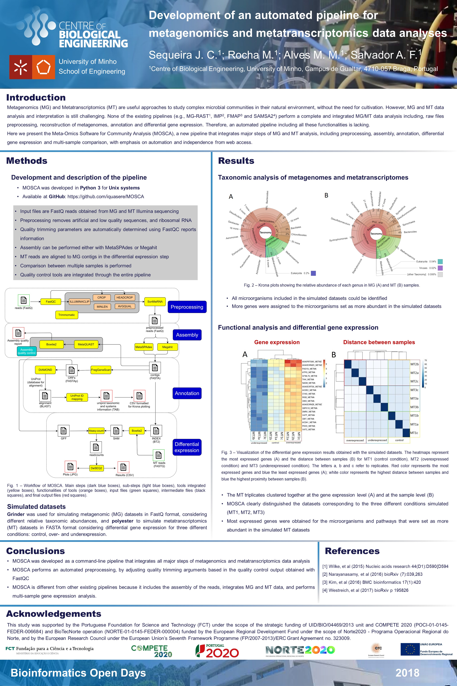
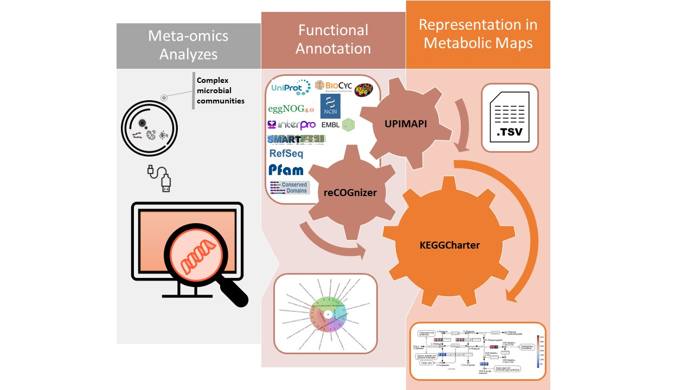
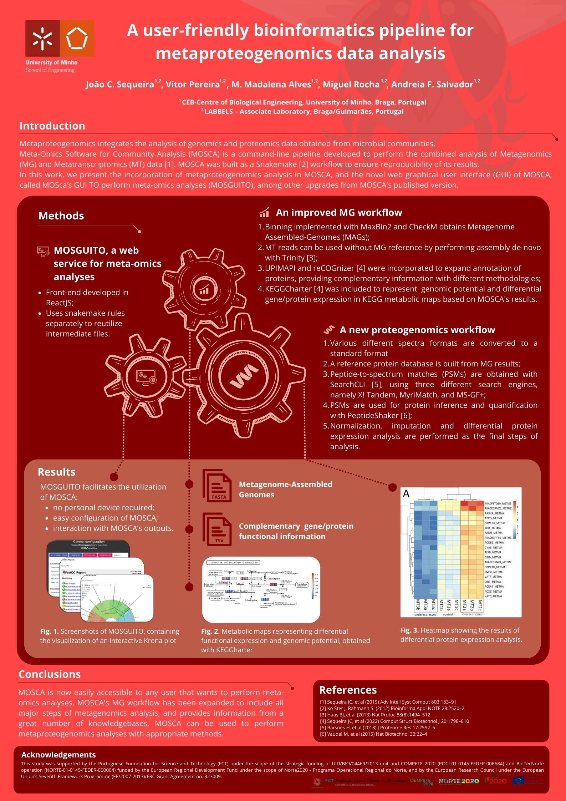

# 📊 Science-Poster-Tools ‍💻

## Table of Contents 📑

* [Introduction](https://github.com/iquasere/Science-Design#Introduction-🚀)
* [PowerPoint](https://github.com/iquasere/Science-Design#PowerPoint-⚡)
* [Canva](https://github.com/iquasere/Science-Design#Canva-🎨)
* [Valuable single-purpose online tools](https://github.com/iquasere/Science-Design#Valuable-single-purpose-online-tools-🌐)

## Introduction 🚀

Scientific posters are an essential aspect of presenting research findings to colleagues and peers. However, designing an effective poster can be challenging and time-consuming, especially if you lack design skills or are not familiar with graphic design software, such as most of us scientist nerds. Fortunately, there are several online tools available that can make the process easier and more enjoyable.

This list compiles only tools that I have used, and is by no means a complete review. However, it should provide enough tools to produce great works of communication, including posters and graphical abstracts, at an interesting cost (i.e., 0 €, since we all scientists living on scholarships).

## PowerPoint ⚡

It's impossible to not know [PowerPoint](https://www.microsoft.com/en-us/microsoft-365/powerpoint), loved and hated by millions of people worldwide, as any proper Microsoft Office product. Because Office is not free, several alternatives exist today, but I've yet to find another one that is as simple and multifunctional to use as PowerPoint. With its extensive range of design templates, easy-to-use interface, and powerful editing tools, PowerPoint is still one of the greatest tools of all time for amateur graphic designers.

  
An example/template of a poster made in PowerPoint

 [template](productions/poster_bod2018.pptx)
  
  
  

  
An example/template of a graphical abstract made in PowerPoint

  
 [template](productions/graphical_abstract.pptx)

  
  

## Canva 🎨

[Canva](https://www.canva.com/) is what I started experimenting with after working for several years on PowerPoint. It is one of the biggest household names among amateur free-based design, offering a range of templates and design elements to create visually appealing graphics. Canva provides a user-friendly interface that allows users to drag and drop elements to create custom posters, but often lacks functionalities that PowerPoint has provided for decades now.

Where I think Canva shines is in its templates. Canva has a large community of designers, that put out great works to begin experimenting and playing it out. Canva is an excellent choice for those who want a simple and intuitive design tool for creating scientific posters. Although it is frustrating not being able to group elements together...

  
An example/template of a poster made in Canva

  
  
  

## Valuable single-purpose online tools 🌐

The following is a list of tools that might provide just one or a few functionalities in a very simple and free way. Sometimes not needed at all, othertimes they are the answer to your problems.

* [draw.io](https://app.diagrams.net/) can build amazing diagrams, and is rightfully one of the most used tools for production of schemes in the scientific medium.

* [removebg](https://www.remove.bg/) removes background of images. It has never failed to remove my picture's backgrounds.

* [DEEditor](https://deeditor.com/) changes icons colours. This is the only tool I managed to use to fix my colour pallets, and is very simple to use.
